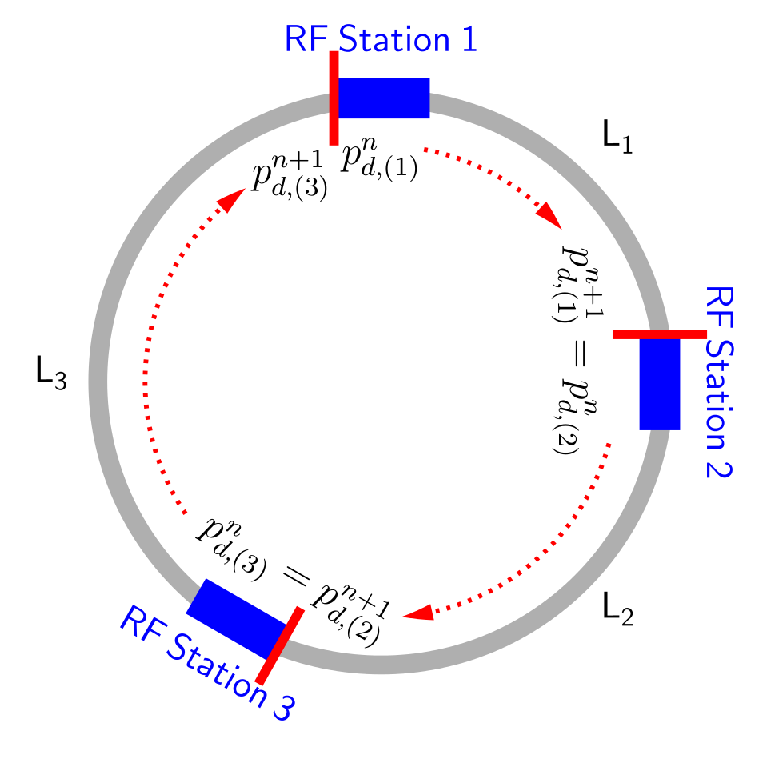

Equations of Motion
===================
:Authors: **Helga Timko**

Below, we shall derive the equations of motion (EOMs) for an energy kick given 
to the particle by the RF caviti(es) of a given RF station and the subsequent 
drift of the particle during one turn, see Figure. In the case of multiple RF 
stations, the drift equation should be scaled by :math:`\frac{L_i}{C}`, where 
:math:`C = \sum_{i} L_i` is the machine circumference.

Definitions
-----------

**Code-internal units** are SI-units unless otherwise specified in the below 
table.

:Code-internal units:

   Energy :math:`E` = [eV] 

   Momentum :math:`p` = [eV] 

   Mass :math:`m` = [eV]

   Time :math:`t` = [s] 
   
   Frequency :math:`f` = [Hz]

   Angular frequency :math:`\omega` = [rad/s]

Just like in the real machine, we demand the user to define beforehand the 
energy programme, i.e. the **synchronous (design) total energy** at every time 
step :math:`n` and RF station :math:`(i)`, :math:`\left\{ E_{s,(i)}^n \right\}`. 
This will define the design momentum :math:`p_s` through following relations:

.. math:: E_s = \gamma_s m ,
   :label: E
.. math:: p_s = \beta_s \gamma_s m ,
   :label: p
.. math:: E_s^2 = p_s^2 + m^2 ,
   :label: E-p

where :math:`m` is the mass of the particle, and energy, momentum, and mass are
given in [eV].

For a given **synchronous orbit with an average radius** :math:`R_s`, the 
angular frequency will be :math:`\omega_0 \equiv \frac{\beta_s c}{R_s}` and one
turn will take :math:`T_0 \equiv \frac{2 \pi}{\omega_0}` at the synchronous 
energy. The magnetic field programme is assumed to be synchronised with the 
design energy turn by turn. Hence, a particle leaving the RF station with the 
synchronous energy will always be on the synchronous orbit and return to the RF
station after exactly one period, unless the actual magnetic field differs from
the designed one.

We define then an external **reference (clock) time**

.. math:: t_{\mathsf{ref}}^n \equiv \sum_{i=1}^n T_0^i ,
   :label: t_ref

and as initial condition we choose the sinusoidal RF wave of the **main RF 
system** (harmonic :math:`h_0` and RF frequency :math:`\omega_{\mathsf{rf},0}`)
to be at phase zero at time zero:

.. math:: V_{\mathsf{rf},0}(t) = V_0 \sin(\omega_{\mathsf{rf},0} \, t \, + \phi_{\mathsf{offset},0}) \Rightarrow \phi_{\mathsf{offset},0} (t=0) = 0.
   :label: IC

**All phase offsets of all RF systems are defined w.r.t. this initial condition
and w.r.t. to the main RF system.** Phase offsets can be programmed through the
``phi_offset`` parameter. In addition, RF phase noise 
:math:`\phi_{\mathsf{noise},k}` can be added through ``phi_noise``  for each 
system. For :math:`n_{\mathsf{rf}}` RF systems in the RF station the total 
voltage [eV] becomes:

.. math:: V_{\mathsf{tot}}(t) = \sum_{k=0}^{n_{\mathsf{rf}}-1} V_k \sin(\omega_{\mathsf{rf},k} \, t + \phi_{\mathsf{offset},k}^n + \phi_{\mathsf{noise},k}^n) .
   :label: Vtot

We define the **arrival time of an arbitrary particle** to the RF station 
relative to the reference time in that turn,

.. math:: \Delta t^n \equiv t^n - t_{\mathsf{ref}}^n .
   :label: dt

The total phase offset at the reference time is tracked in the variable
``phi_RF``, defined through

.. math:: V_{\mathsf{tot}}(t=t_{\mathsf{ref}}^n) \equiv \sum_{k=0}^{n_{\mathsf{rf}}-1} V_k \sin(\phi_{\mathsf{rf},k}^n) .
   :label: phiRF

Energy kick
-----------

During the passage through an RF station, the energy :math:`E^n` of an 
arbitrary particle is changed by the total energy kick received from the 
various RF systems in the station. The energy change due to the induced 
electric fields in the magnets is negligible and beam-induced voltage is taken
into account in the ``impedance`` module. The phase of the RF voltage of system
k at the arrival time :math:`t^n` of any particle is:

.. math:: \varphi_{\mathsf{rf},k}(t^n) = \int_{0}^{t^n} d\tau \, \omega_{\mathsf{rf}}(\tau) + \phi_{\mathsf{offset},k}^n + \phi_{\mathsf{noise},k}^n = \sum_{i=1}^{n} \omega_{\mathsf{rf},k}^i T_0^i + (t^n-t_{\mathsf{ref}}^n) \omega_{\mathsf{rf},k}^n + \phi_{\mathsf{offset},k}^n + \phi_{\mathsf{noise},k}^n .
   :label: 1-0-1

Subtracting multiples of :math:`2 \pi`, which can be neglected,

.. math:: \varphi_{\mathsf{rf},k}(\Delta t^n) = \sum_{i=1}^{n} \frac{\omega_{\mathsf{rf},k}^i - h_k^i \omega_0^i}{h_k^i \omega_0^i} 2 \pi h_k^i + \omega_{\mathsf{rf},k}^n \Delta t^n + \phi_{\mathsf{offset},k}^n + \phi_{\mathsf{noise},k}^n .
   :label: 1-0-2
   
Note that ``phi_RF`` is determined through the above equation,

.. math:: \phi_{\mathsf{rf},k}^n = \varphi_{\mathsf{rf},k}(\Delta t^n = 0) .
   :label: 1-0-3
   
Thus the total energy change equation is

.. math:: E^{n+1} = E^{n} + \sum_{k=0}^{n_{\mathsf{rf}}-1} V_k^n \sin \varphi_{\mathsf{rf},k}(\Delta t^n)
   :label: 1-1

.. note:: Eq. :eq:`1-1` is intrinsically discrete; no approximation has been 
   done.

.. note:: The RF phase (Eq. :eq:`1-0-3`) differs from the sum of phase offset 
   and phase noise only if the RF frequency differs from the design RF frequency 
   :math:`\omega_{\mathsf{rf},k}^n \neq \Omega_{\mathsf{rf},k}^n \equiv h_k^n \omega_0^n`, 
   i.e. when feedback loops are active.

Rather than the absolute energy, we are actually interested in the energy 
offset of a given particle w.r.t. the synchronous energy 
:math:`\Delta E^n \equiv E^n - E_s^n, \, \forall n`. So we choose our 
coordinate system to be centred around :math:`E_s^n \, \forall n`. Substracting
:math:`E_s^{n+1}` from both sides of Eq. :eq:`1-1`, we arrive at

.. math:: \Delta E^{n+1} = \Delta E^{n} + \sum_{k=0}^{n_{\mathsf{rf}}-1} V_k^n \sin \varphi_{\mathsf{rf},k}(\Delta t^n) - (E_s^{n+1} - E_s^n) .
   :label: 1-2

.. warning:: As a consequence, during acceleration the coordinate system is 
   non-inertial and a coordinate transform is done turn by turn.

Arrival time drift
------------------

.. sidebar:: Frequency slippage

   The frequency slippage of an off-momentum particle during one turn is 
   defined w.r.t. the **design synchronous particle**,

   .. math:: \frac{\Delta \omega}{\omega_0} = \frac{\omega - \omega_0}{\omega_0} \equiv - \eta(\delta) \delta = - (\eta_0 + \eta_1 \delta + \eta_2 \delta^2 + ...) \delta,
      :label: slippage

   where :math:`\delta \equiv \frac{\Delta p}{p_s} = \frac{\Delta E}{\beta_s^2 E_s}` 
   is the relative off-momentum of the particle and :math:`\eta_i` are the 
   slippage factors 

   .. math:: \eta_0 = \alpha_0 - \frac{1}{\gamma_s^2} \\
      \eta_1 = \frac{3 \beta_s^2}{2 \gamma_s^2} + \alpha_1 - \alpha_0 \eta_0 \\
      \eta_2 = - \frac{\beta_s^2(5 \beta_s^2 - 1)}{2 \gamma_s^2} + \alpha_2 - 2 \alpha_0 \alpha_1 + \frac{\alpha_1}{\gamma_s^2} + \alpha_0^2 \eta_0 - \frac{3 \beta_s^2 \alpha_0}{2 \gamma_s^2},
      :label: etas      

   which are defined via the momentum compaction factors :math:`\alpha_i`. 

The absolute arrival time of an arbitrary particle can be expressed as a 
recursion

.. math:: t^{n+1} = t^n + \frac{2 \pi}{\omega^{n+1}} ,
   :label: 2-1

with initial condition :math:`t^0 = t_0` and where the revolution frequency of
the particle :math:`\omega^n \equiv \frac{\beta^n c}{R^n}` can differ from 
:math:`\omega_0^n` due to energy and orbit deviations from the synchronous 
particle.

.. note:: Eq. :eq:`2-1` contains :math:`\omega^{n+1}` as we chose to perform 
   the energy kick first and the subsequent time drift happens according to the
   already updated energy.

Using Eq. :eq:`dt`, the recursion on the particle arrival time relative to the
clock becomes

.. math:: \Delta t^{n+1} = \Delta t^n + \frac{2 \pi}{\omega^{n+1}} - \frac{2 \pi}{\omega_0^{n+1}} =
   \Delta t^n + T_0^{n+1} \left( \frac{1}{\frac{\omega^{n+1}}{\omega_0^{n+1}}} - 1 \right)
   :label: 2-2

Using definition :eq:`slippage`, the arrival time drift can be calculated as

.. math:: \Delta t^{n+1} = \Delta t^n + T_0^{n+1} \left( \frac{1}{1 - \eta(\delta^{n+1})\delta^{n+1}} - 1 \right) .
   :label: 2-3

If a zeroth order slippage is used, :math:`\eta(\delta) \approx \eta_0`, the 
option ``solver = 'simple'`` can be used to approximate the above equation as

.. math:: \Delta t^{n+1} = \Delta t^n + \frac{\eta_0^{n+1} T_0^{n+1}}{(\beta_s^{n+1})^{2} E_s^{n+1}} \Delta E^{n+1} .
   :label: 2-3-simple

In a newer implementation of the drift equation, default since 2020, we use the momentum compaction factors directly,
instead of the slippage factors, to calculate the time slippage,

.. math:: \Delta t^{n+1} = \Delta t^n + T_0^{n+1} \left[(1 + \alpha_0^{n+1}\delta^{n+1} + \alpha_1^{n+1}(\delta^{n+1})^2 +
    \alpha_2^{n+1}(\delta^{n+1})^3) \left( \frac{1 + \frac{\Delta E^{n+1}}{E_s^{n+1}}}{1 + \delta^{n+1}} \right) - 1 \right]
    :label: 2-alpha

The synchronous particle
------------------------

A particle is **synchronous in turn n** if it enters and leaves the RF station
with zero energy offset, :math:`\Delta E^n = \Delta E^{n+1} = 0`, and thus 
gains exactly the designed energy gain :math:`E_s^{n+1} - E_s^n`. As a 
consequence, in the absence of induced voltage the synchronous particle will 
fulfil:

.. math:: \sum_{k=0}^{n_{\mathsf{rf}}-1} V_k^n \sin \varphi_{\mathsf{rf},k}(\Delta t_s^n) = (E_s^{n+1} - E_s^n) ,
   :label: E_s

and in the presence of intensity effects, the induced voltage from the 
particles in front should be added on the left-hand side: 

.. math:: \sum_{k=0}^{n_{\mathsf{rf}}-1} V_k^n \sin \varphi_{\mathsf{rf},k}(\Delta t_s^n) - e \int_{\Delta t_{\mathsf{min}}}^{\Delta t_s^n} d\tau \lambda(\tau) W(\Delta t_s^n - \tau) = (E_s^{n+1} - E_s^n) ,
   :label: E_s-2

where :math:`\lambda(t)` is the beam/bunch profile and :math:`W(t)` the wake 
potential.

.. seealso:: http://dquartul.github.io/BLonD/impedances.html

.. warning:: In general, these equations have :math:`n_{\mathsf{rf}}` 
   solutions. If the synchronous energy gain :math:`E_s^{n+1} - E_s^n` changes
   from one turn to another, also the synchronous particle changes with it. 

.. note:: **Synchronous particle arrival time**

   As a consequence, the arrival time of the synchronous particle 
   :math:`\Delta t_s` is not necessarily constant, but can change from turn to
   turn. This might be counter-intuitive, as the synchronous particle drifts 
   with exactly :math:`\omega_0` along the ring. To see this effect, consider 
   two subsequent turns with different synchronous energy gains 
   :math:`E_s^{n+1} - E_s^{n} \ne E_s^{n+2} - E_s^{n+1}` in a single-RF system.
   Let particle 1 be synchronous in turn n and particle 2 be synchronous in 
   turn :math:`n+1`: 

   .. math:: \Delta E_1^n = \Delta E_1^{n+1} = 0 \,\,\, \ne \Delta E_1^{n+2} \\
      \Delta t_1^{n-1} = \Delta t_1^n = \Delta t_1^{n+1} \,\,\, \ne \Delta t_1^{n+2}
      :label: synch-1

   .. math:: \Delta E_2^n \ne \,\,\, \Delta E_2^{n+1} = \Delta E_2^{n+2} = 0  \\
      \Delta t_2^{n-1} \ne \,\,\, \Delta t_2^n = \Delta t_2^{n+1} = \Delta t_2^{n+2}
      :label: synch-2

   The arrival time of the synchronous particles in this case will be:

   .. math:: \Delta t_s^n \equiv \Delta t_1^n \\
      \Delta t_s^{n+1} \equiv \Delta t_2^{n+1}
      :label: synch-3

   Thus, because the synchronous particle can be a different particle each 
   turn, the recursion on the synchronous arrival time becomes in general 

   .. math:: \Delta t_s^{n+1} = \Delta t_s^n + (\Delta t_2^{n+1} - \Delta t_1^n) = \Delta t_s^n + (\Delta t_2^n - \Delta t_1^n) .
      :label: synch-4

   The difference in arrival time of the two particles in turn n can be 
   determined from the energy equations

   .. math:: V^n \sin \left( \omega_{\mathsf{rf}}^n \Delta t_1^n + \varphi_{\mathsf{rf}}^n \right)= (E_s^{n+1} - E_s^n) \\
      V^{n+1} \sin \left( \omega_{\mathsf{rf}}^{n+1} \Delta t_2^{n+1} + \varphi_{\mathsf{rf}}^{n+1} \right) =  V^{n+1} \sin \left( \omega_{\mathsf{rf}}^{n+1} \Delta t_2^n + \varphi_{\mathsf{rf}}^{n+1} \right) = (E_s^{n+2} - E_s^{n+1}) , 
      :label: synch-5

   which in first-order approximation (see *Small-amplitude oscillations*) 
   gives

   .. math:: \sin{\varphi_s^{n+1}} - \sin{\varphi_s^n} \approx ( \omega_{\mathsf{rf}}^{n+1} \Delta t_2^n + \varphi_{\mathsf{rf}}^{n+1} - \omega_{\mathsf{rf}}^n \Delta t_1^n - \varphi_{\mathsf{rf}}^n) \cos{\varphi_s^n} = \frac{E_s^{n+2} - E_s^{n+1}}{V^{n+1}} - \frac{E_s^{n+1} - E_s^{n}}{V^{n}} .
      :label: synch-6

Small-amplitude oscillations
----------------------------

Assuming a single-RF station and a simple solver (Eq. :eq:`2-3-simple`), the 
EOMs in continous time can be written as

.. math:: \Delta \dot{E} = \frac{V}{T_0} \left( \sin(\omega_{\mathsf{rf}} \Delta t + \varphi_{\mathsf{rf}}) - \sin{\varphi_s} \right),
   :label: HO-1

.. math:: \Delta \dot{t} = \frac{\eta_0}{\beta_s^2 E_s} \Delta E .
   :label: HO-2

Assuming further a constant synchronous phase 
:math:`\sin{\varphi_s} \equiv \frac{\dot{E_s}}{V}` and expanding the RF wave 
around it 

.. math:: \omega_{\mathsf{rf}} \Delta t + \varphi_{\mathsf{rf}} = \varphi_s + (\omega_{\mathsf{rf}} \Delta t + \varphi_{\mathsf{rf}} - \varphi_s) \equiv \varphi_s + \varepsilon , \,\,\, \varepsilon \ll 1 , 
   :label: HO-3-0
   
we obtain for the sinusoidal term in first order

.. math:: \sin (\omega_{\mathsf{rf}} \Delta t + \varphi_{\mathsf{rf}}) = \sin {\varphi_s} \cos{\varepsilon} + \cos{\varphi_s} \sin{\varepsilon} \approx \sin{\varphi_s} (1 + \mathcal{O}(\varepsilon^2)) +  \cos{\varphi_s} (\varepsilon + \mathcal{O}(\varepsilon^3)) .
   :label: HO-3-1

Derivating Eq. :eq:`HO-1` a second time, and using Eq. :eq:`HO-2`

.. math:: \Delta \ddot{E} = \frac{V \cos{\varphi_s} \, \omega_{\mathsf{rf}}}{T_0} \Delta \dot{t} = \frac{V \eta_0 \cos{\varphi_s} \, \omega_{\mathsf{rf}} \omega_0 }{2 \pi \beta_s^2 E_s} \Delta E .
   :label: HO-3

Vice versa, derivating :eq:`HO-2` another time, and substituting 
Eq. :eq:`HO-1`, an equivalent equation can be found for the arrival time w.r.t.
to the arrival of the synchronous particle :math:`\Delta t_s`:

.. math:: \Delta \ddot{t} - \Delta \ddot{t_s} = \frac{V \eta_0 \cos{\varphi_s} \, \omega_{\mathsf{rf}} \omega_0 }{2 \pi \beta_s^2 E_s} (\Delta t - \Delta t_s) .
   :label: HO-4

Equations :eq:`HO-3` and :eq:`HO-4` describe an oscillating motion in phase 
space if :math:`\eta_0 \cos{\varphi_s} < 0`, which for 
:math:`\omega_{\mathsf{rf}} = h \omega_0` has the synchrotron frequency

.. math:: \omega_{s,0} = \sqrt{\frac{- h V \eta_0 \cos{\varphi_s}}{2 \pi \beta_s^2 E_s}} \omega_0 .
   :label: omega_s

.. note:: that energy and time are conjugate variables, whereas energy and 
   phase are not. When forming time derivatives in phase, one should take into 
   account the frequency correction from one turn to another: 
   :math:`\dot{\varphi} \approx \varphi^{n+1} - \frac{\omega_{\mathsf{rf}}^{n+1}}{\omega_{\mathsf{rf}}^n} \varphi^n`.

Tracking utilities
==================

Hamiltonian
-----------

To construct the Hamiltonian :math:`\mathcal{H}` from the conjugate variables 
:math:`\Delta t` and :math:`\Delta E`, let us first rewrite the equations of 
motion in continuous time (for a zeroth-order slippage factor):

.. math:: \dot{\Delta t} = \frac{\Delta t^{n+1} - \Delta t^n}{T_0^{n+1}} = \frac{\eta_0}{\beta_s^2 E_s} \Delta E = \frac{\partial \mathcal{H}}{\partial (\Delta E)} ,
   :label: hamiltonian-1

.. math:: \dot{\Delta E} = \frac{\Delta E^{n+1} - \Delta E^n}{T_0^{n+1}} = \sum_{k=0}^{n_{\mathsf{rf}}-1} \frac{q V_k}{T_0} \sin (\omega_{\mathsf{rf}}^k \Delta t + \varphi_{\mathsf{rf}}^k) - \dot{E_s} = - \frac{\partial \mathcal{H}}{\partial (\Delta t)} ,
   :label: hamiltonian-2

from which we obtain the Hamiltonian by partial integration:

.. math:: \mathcal{H}(\Delta t, \Delta E) = \int d(\Delta t) \partial_{\Delta t} \mathcal{H}  + \int d(\Delta E) \partial_{\Delta E} \mathcal{H}  = \int d(\Delta E) \dot{\Delta t} - \int d(\Delta t) \dot{\Delta E} , 
.. math:: \mathcal{H}(\Delta t, \Delta E) = \frac{\eta_0}{2 \beta_s^2 E_s}(\Delta E)^2 + \sum_{k=0}^{n_{\mathsf{rf}}-1} \frac{q V_k}{T_0 \omega_{\mathsf{rf}}^k} \cos (\omega_{\mathsf{rf}}^k \Delta t + \varphi_{\mathsf{rf}}^k) + \dot{E_s} \Delta t + \mathsf{const} .

The constant of integration can be chosen such that 

.. math:: \mathcal{H}(\Delta t = \Delta t_s, \Delta E = 0) = 0 ,

from which the Hamiltonian becomes

.. math:: \mathcal{H}(\Delta t, \Delta E) = \frac{\eta_0}{2 \beta_s^2 E_s}(\Delta E)^2 + \sum_{k=0}^{n_{\mathsf{rf}}-1} \frac{q V_k}{T_0 \omega_{\mathsf{rf}}^k} \left( \cos (\omega_{\mathsf{rf}}^k \Delta t + \varphi_{\mathsf{rf}}^k) - \cos (\omega_{\mathsf{rf}}^k \Delta t_s + \varphi_{\mathsf{rf}}^k) \right) + \dot{E_s} (\Delta t - \Delta t_s) .

In case of a single-harmonic RF system with 
:math:`\omega_{\mathsf{rf}} = h \omega_0`, the second term can be replaced 
with :math:`\dot{E_s} = q V \sin{\varphi_s} / T_0`, and we obtain the know 
textbook formula

.. math:: \mathcal{H}(\Delta t, \Delta E) = \frac{\eta_0}{2 \beta_s^2 E_s}(\Delta E)^2 + \frac{q V}{2 \pi h} \left( \cos (h \omega_0 \Delta t + \varphi_{\mathsf{rf}}) - \cos (h \omega_0 \Delta t_s + \varphi_{\mathsf{rf}}) + h \omega_0 (\Delta t - \Delta t_s) \sin{\varphi_s} \right) ,

or in terms of particle phase :math:`\varphi`,

.. math:: \mathcal{H}(\varphi, \Delta E) = \frac{\eta_0}{2 \beta_s^2 E_s}(\Delta E)^2 + \frac{q V}{2 \pi h} \left( \cos \varphi - \cos \varphi_s + (\varphi - \varphi_s) \sin{\varphi_s} \right) .

Separatrix
----------

To construct the separatrix, first the unstable fixed point (UFP) needs to be
determined. Its coordinates :math:`(\Delta t_{\mathsf{ufp}}, \Delta E = 0)` are
calculated numerically by looking for the smallest (largest) zero crossing 
position in one period of the total voltage waveform above (below) transition. 
The separatrix is the equipotential line that goes through the UFP and is thus
defined by the condition 

.. math:: \mathcal{H}(\Delta t_{\mathsf{ufp}}, \Delta E = 0) = \mathcal{H}(\Delta t_{\mathsf{sep}}, \Delta E_{\mathsf{sep}}) .

Solving this equation we obtain

.. math:: \Delta E_{\mathsf{sep}} =  \pm \sqrt{ \frac{2 \beta_s^2 E_s}{\eta_0} \left \{ \sum_{k=0}^{n_{\mathsf{rf}}-1} \frac{q V_k}{T_0 \omega_{\mathsf{rf}}^k} \left [ \cos (\omega_{\mathsf{rf}}^k \Delta t_{\mathsf{ufp}} + \varphi_{\mathsf{rf}}^k) - \cos (\omega_{\mathsf{rf}}^k \Delta t_{\mathsf{sep}} + \varphi_{\mathsf{rf}}^k) \right ] + \dot{E_s} (\Delta t_{\mathsf{ufp}} - \Delta t_{\mathsf{sep}}) \right \}} .

In the case of a single-harmonic RF system with 
:math:`\omega_{\mathsf{rf}} = h \omega_0`, the phase of the UFP is 
:math:`\varphi_{\mathsf{ufp}} = \pi - \varphi_s`. In addition, 
:math:`\dot{E_s} = q V \sin{\varphi_s} / T_0`, so the above equation reduces to

.. math:: \Delta E_{\mathsf{sep}} =  \pm \sqrt{ \frac{2 \beta_s^2 E_s q V}{2 \pi h \eta_0} \left \{ \cos (\pi - \varphi_s) - \cos \varphi + (\pi - \varphi_s - \varphi) \sin \varphi_s \right \} }.

In practise, to calculate the separatrix for input arrays 
:math:`\Delta t_{\mathsf{sep}}` that are longer than the period of the voltage
waveform, the routine takes into account periodicity and projects the input 
array onto the 'basic period' of the waveform (that is :math:`(-\pi,\pi)` and
:math:`(0,2 \pi)` on the first harmonic, below and above transition, 
respectively). 

