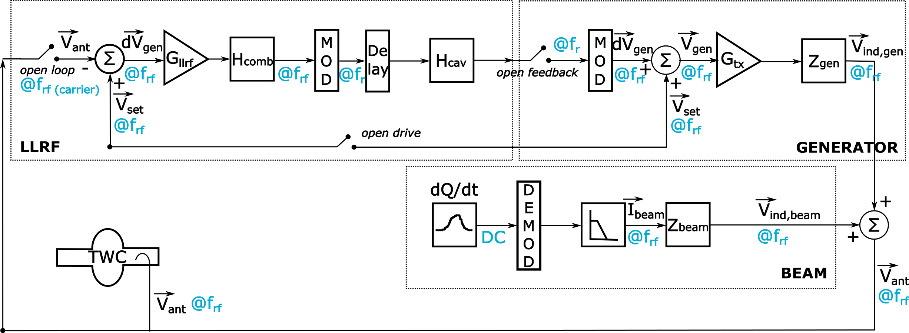

SPS Cavity Loop
===============
:Authors: **Birk Emil Karlsen-Bæck**, **Helga Timko**

TRAVELLING WAVE CAVITY
----------------------

The voltage in the SPS travelling-wave cavities (TWC) is the sum of the generator-induced voltage
:math:`V_\mathsf{gen}` and the beam-induced voltage :math:`V_\mathsf{beam}`,

.. math::

    V_\mathsf{ant} = V_\mathsf{gen} + V_\mathsf{beam} = I_\mathsf{gen} Z_\mathsf{gen} + I_\mathsf{beam} Z_\mathsf{beam}\, ,

where :math:`I` represents currents and :math:`Z` represent impedances. As shown by
`G. Dome <https://cds.cern.ch/record/319440>`_, the impedance of the beam towards the TWC can be expressed as

.. math::

    Z_\mathsf{beam} (\omega) =
    \frac{\rho l^2}{8} \left[
    \left( \frac{\sin \left(\frac{\tau(\omega - \omega_r)}{2}\right)}{\frac{\tau(\omega - \omega_r)}{2}} \right)^2
    - 2i \frac{\tau(\omega - \omega_r) - \sin(\tau(\omega - \omega_r))}{(\tau(\omega - \omega_r))^2}
    + \left( \frac{\sin \left(\frac{\tau(\omega + \omega_r)}{2}\right)}{\frac{\tau(\omega + \omega_r)}{2}} \right)^2
    + 2i \frac{\tau(\omega + \omega_r) - \sin(\tau(\omega + \omega_r))}{(\tau(\omega + \omega_r))^2}
    \right] \, .

Here, the TWC has the following properties:

* :math:`\rho = 27.1 \frac{\mathsf{k\Omega}}{\mathsf{m}^2}` is the series impedance
* :math:`l = (11 n_\mathsf{sections} - 1) \times 0.374 \mathsf{m}` is the accelerating length of the cavity, depending
  on the number of sections :math:`n_\mathsf{sections}`
* :math:`\tau = \frac{l}{v_g} \left( 1 + \frac{v_g}{c} \right)` is the cavity filling time, where the group velocity is
  :math:`v_g = 0.0946 c`
* :math:`\omega_r = 200.222 \mathsf{MHz}` is the resonant frequency of the TWC

The impedance of the generator towards the TWC is

.. math::

    Z_\mathsf{gen} (\omega) =
    l \sqrt{\frac{\rho Z_0}{2}}
    \left[ \frac{\sin \left(\frac{\tau(\omega - \omega_r)}{2}\right)}{\frac{\tau(\omega - \omega_r)}{2}}  +
    \frac{\sin \left(\frac{\tau(\omega + \omega_r)}{2}\right)}{\frac{\tau(\omega + \omega_r)}{2}} \right] \, ,

where :math:`Z_0` is the shunt impedance when measuring the generator current; assumed to be 50 :math:`\Omega`.

Induced-voltage calculation
~~~~~~~~~~~~~~~~~~~~~~~~~~~

In the discrete time system, the induced voltage :math:`V(t)` is obtained from the impulse response :math:`h(t)` and the
complex (cavity or generator) current :math:`I(t)`, broken down to in-phase (I) and quadrature (Q) components. The
induced-voltage calculation can be written in matrix form,

.. math::
    \left( \begin{matrix} V_I(t) \\
    V_Q(t) \end{matrix} \right)
    = \left( \begin{matrix} h_s(t) & - h_c(t) \\
    h_c(t) & h_s(t) \end{matrix} \right)
    * \left( \begin{matrix} I_I(t) \\
    I_Q(t) \end{matrix} \right) \, ,

where :math:`*` denotes convolution,
:math:`h(t)*x(t) = \int d\tau h(\tau)x(t-\tau)`.

.. _beam-ind-V:

Beam-induced voltage
^^^^^^^^^^^^^^^^^^^^

For the voltage induced by the beam towards the TWC, we define the short-hand notation

.. math::
    R_\mathsf{beam} \equiv \frac{\rho l^2}{8} \, .

The beam-induced wake is

.. math::
    W_\mathsf{beam}(t) = \frac{4 R_\mathsf{beam}}{\tau} \mathsf{tri}\left(\frac{t}{\tau}\right) \cos(\omega_r t)

and the impulse response components are

.. math::
    h_{s,\mathsf{beam}}(t) &= \frac{2 R_\mathsf{beam}}{\tau} \mathsf{tri}\left(\frac{t}{\tau}\right)
     \cos((\omega_c - \omega_r)t) \, , \\
    h_{c,\mathsf{beam}}(t) &= \frac{2 R_\mathsf{beam}}{\tau} \mathsf{tri}\left(\frac{t}{\tau}\right)
    \sin((\omega_c - \omega_r)t) \, ,

where :math:`\mathsf{tri}(x)` is the triangular function and :math:`\omega_c` is the carrier revolution frequency of the
I,Q demodulated current signal. On the resonant frequency of the cavity, :math:`\omega_c = \omega_r`,

.. math::
    h_{s,\mathsf{beam}}(t) &= \frac{2 R_\mathsf{beam}}{\tau} \mathsf{tri}\left(\frac{t}{\tau}\right) \\
    h_{c,\mathsf{beam}}(t) &= 0 \, .

.. _gen-ind-V:

Generator-induced voltage
^^^^^^^^^^^^^^^^^^^^^^^^^

For the voltage induced by the generator towards the TWC, we define

.. math::
    R_\mathsf{gen} \equiv l \sqrt{\frac{\rho Z_0}{2}} \, .

The generator-induced wake is

.. math::
    W_\mathsf{gen}(t) = \frac{2 R_\mathsf{gen}}{\tau} \mathsf{rect}\left(\frac{t}{\tau}\right)\cos(\omega_r t)

and the impulse-response components are

.. math::
    h_{s,\mathsf{gen}}(t) &= \frac{R_\mathsf{gen}}{\tau} \mathsf{rect}\left(\frac{t}{\tau}\right)
    \cos((\omega_c - \omega_r)t) \, , \\
    h_{c,\mathsf{gen}}(t) &= \frac{R_\mathsf{gen}}{\tau} \mathsf{rect}\left(\frac{t}{\tau}\right)
    \sin((\omega_c - \omega_r)t) \, ,

where :math:`\mathsf{rect}(x)` is the rectangular function. On the resonant frequency of the TWC,
:math:`\omega_c = \omega_r`,

.. math::
    h_{s,\mathsf{gen}}(t) &= \frac{R_\mathsf{gen}}{\tau} \mathsf{rect}\left(\frac{t}{\tau}\right) \\
    h_{c,\mathsf{gen}}(t) &= 0 \, .

THE CAVITY CONTROLLER
---------------------

The cavity controller is a one-turn feedback, measuring in one turn and correcting in the turn after. It works on the
carrier frequency of the present RF frequency :math:`f_{c}=f_{\mathsf{rf}}`. The cavity response is applied at
the central or resonant frequency of the cavity :math:`f_{r}`, requiring and up- and down-modulation before and after.
The controller loop is built of three entities in the code, see Figure.

Signal sampling
~~~~~~~~~~~~~~~

For beam particle tracking, the voltage amplitude and phase correction are calculated w.r.t.\ the values specified by
the user in the RFStation object (voltage amplitude and phase set points). This correction is calculated on the time
range and with the resolution of the beam Profile object; in the context of the cavity controller, we call it the
*fine grid*.

The generator-induced voltage towards the cavity, as well as the low-level RF part are resolved on a bucket-by-bucket
basis, which we call the *coarse grid*. The arrays cover the full ring, and keep in memory the previous turn for the
tracking of the feedback. The sampling time :math:`T_s` in turn :math:`n` is defined as

.. math::

    T_{s,n} = T_{\mathsf{rf},n} \, ,

where :math:`T_{\mathsf{rf},n}` is the RF period of the main RF system in the given turn. Arrays on the coarse grid have

.. math::

    n_{\mathsf{coarse}} \equiv \mathsf{int} \left( \frac{T_{\mathsf{rev},0}}{T_{\mathsf{rf},0}} \right)

sampling points, defined based on the initial revolution (:math:`T_{\mathsf{rev},0}`) and RF periods. The centres of the
sample number :math:`k` along the time axis are

.. math::

    \mathsf{rf\_centers}_{k,n} = (i + \frac{1}{2}) T_{s,n} \, .

.. note::
    When the RF frequency is not an integer multiple of the revolution frequency (as a result of the user declaring a
    non-harmonic RF frequency, or a beam feedback making a correction on the RF frequency, or both), a fraction of an RF
    period will be unsampled, and in the next turn, the RF signals are again sampled w.r.t. the beginning of the turn
    :math:`t_\mathsf{ref}`, as declared in the :doc:`equations_of_motion`. The non-harmonic RF frequency also results in
    the RF system :math:`s` in an accumulated phase shift of

    .. math::
        \sum_{i=1}^{n} \frac{\omega_{\mathsf{rf},s}^i - h_s^i \omega_0^i}{h_s^i \omega_0^i} 2 \pi h_s^i

    between the signals of one turn to another. This phase shift is tracked in the :mod:`blond.trackers.tracker`; the
    the signal processing in the one-turn feedback, however, is performed w.r.t. the zero phase of the reference clock,
    and up- and down-modulation of (I,Q) signals does therefore not require a phase shift. In addition, the non-harmonic
    RF frequency can lead to a changing number of sampling points :math:`n_{\mathsf{coarse}}` over time; this feature is
    presently not implemented in the SPS one-turn feedback and will thus result in a Runtime Error.

To pass information back and forth between the cavity controller and the voltage corrections to be applied, information
from the coarse grid has to be interpolated to the fine grid, and information on the fine grid has to be evaluated also
on the coarse grid.

Low-level RF
~~~~~~~~~~~~

The low-level RF (LLRF) contains the comparison between the desired set-point voltage :math:`V_{\mathsf{set}}` and the
actual antenna voltage :math:`V_{\mathsf{ant}}` in the travelling wave cavity (TWC), and acts on the difference
:math:`dV_{\mathsf{gen}}=V_{\mathsf{set}}-V_{\mathsf{ant}}` with the gain :math:`G_{\mathsf{llrf}}`. The comb filter
:math:`H_{\mathsf{comb}}` represents the LLRF filter that reduces the beam loading seen by the beam. It acts bunch by
bunch, and with exactly one turn delay,

.. math::

    dV_{\mathsf{gen,out}, k, n} = a_{\mathsf{comb}} \, dV_{\mathsf{gen,out}, k, n-1} + (1 - a) \, dV_{\mathsf{gen,in}, k, n} \, ,

where :math:`V_{\mathsf{gen,in}}` and :math:`V_{\mathsf{gen,out}}` are at the input and output of the comb filter,
respectively, :math:`k` is the sample number along the ring (in time), and :math:`n` is the index of the turn. The comb
filter constant is :math:`a_{\mathsf{comb}}=15/16` operationally. The output of the comb filter is filtered by the
cavity response :math:`H_{\mathsf{cav}}` represented as a moving average at 40~MS/s. The moving average over :math:`K`
points is

.. math::

    dV_{\mathsf{gen,out}, k} = \frac{1}{K} \sum_{i=k-K}^{k} dV_{\mathsf{gen,in}, i} \, .

Generator-induced voltage
~~~~~~~~~~~~~~~~~~~~~~~~~

On the generator branch, the transmitter gain :math:`G_\mathsf{tx}` is applied and the voltage signal is converted into
a charge distribution signal according to the transmitter model,

.. math::

    I_{\mathsf{gen}} = G_\mathsf{tx} \frac{V_{\mathsf{gen}}}{R_{\mathsf{gen}}} T_s \, ,

where the units are :math:`[G_\mathsf{tx}] = 1`, :math:`[V_\mathsf{gen}] = V`, :math:`[R_\mathsf{gen}] = \Omega`, and
:math:`[T_s] = s`. The resulting charge distribution is given in :math:`[I_{\mathsf{gen}}] = C`. The generator-induced
voltage :math:`V_\mathsf{ind,gen}` is then calculated from :math:`I_{\mathsf{gen}}` with the matrix convolution through
the generator impulse response, as explained above in :ref:`gen-ind-V`.

Both the voltage and the current are calculated on the *coarse* grid.

Beam-induced voltage
~~~~~~~~~~~~~~~~~~~~

On the beam-induced voltage branch, the beam profile is used as an input to calculate the RF component of the beam
current, :math:`I_{\mathsf{beam}}`. Just like on the generator branch, this complex (I,Q) current is then matrix-
convolved with the beam response, as described in :ref:`beam-ind-V`, to obtain the beam-induced voltage
:math:`V_\mathsf{ind,beam}`.

The voltage and the current are calculated both on the *fine* and the *coarse* grid.

.. warning::
    The generator-induced voltage and current are calculated for all :math:`n_{\mathsf{cavities}}` with the same amount
    of sections. The beam-induced voltage is calculated for one cavity and is multiplied with the number of cavities
    afterwards.

From coarse to fine grid and back
~~~~~~~~~~~~~~~~~~~~~~~~~~~~~~~~~

For beam particle tracking, the voltage amplitude and phase correction w.r.t.\ the set point values is applied on the
grid of the beam profile, slice by slice. In order to calculate this correction, the generator-induced voltage is
interpolated to the fine grid, and added to the beam-induced voltage already evaluated on the fine grid.

To track the SPS one-turn feedback itself, the generator- and beam-induced voltages are summed on the coarse grid that
covers the entire turn,

.. math::

    V_\mathsf{ant} = V_\mathsf{ind,gen} + V_\mathsf{ind,beam} \, .

Feeding corrections into the tracker
~~~~~~~~~~~~~~~~~~~~~~~~~~~~~~~~~~~~

Without the OTFB present in the code, the RF voltage that the particles in the simulations will see is
given by

.. math::

    V_\mathsf{eff}(t) = \left | V_\mathsf{RF} \right |
    \sin{\left (\omega_\mathsf{RF} \Delta t + \varphi_\mathsf{RF} \right )}.

However, when the OTFB is active the particles will in reality see the antenna voltage, hence

.. math::

    V_\mathsf{eff}(t) = \left | V_\mathsf{ant} \right |
    \sin{\left (\omega_\mathsf{RF} \Delta t + \varphi_\mathsf{ant} \right )}.

The antenna voltage is given by :math:`V_{\mathsf{ant}} = V_{\mathsf{gen}} + V_{\mathsf{beam}}`
and the set point is exactly equal to :math:`V_{\mathsf{set}} = V_{\mathsf{rf}}` where :math:`V_{\mathsf{rf}}`
is the RF voltage inside the tracker object without any OTFB corrections. By defining a correction voltage
:math:`V_\mathsf{corr}` as

.. math::

    \left | V_\mathsf{ant} \right | e^{i \varphi_\mathsf{ant}} =
    \left | V_\mathsf{corr} \right | e^{i \varphi_\mathsf{corr}}
    \left | V_\mathsf{set} \right | e^{i \varphi_\mathsf{set}}

and using the fact that the set point in the OTFB is equal to the uncorrected RF voltage in the
tracker, we can express

.. math::
    V_\mathsf{eff}(t) = \left | V_\mathsf{ant} \right |
    \sin{\left (\omega_\mathsf{RF} \Delta t + \varphi_\mathsf{ant} \right )} =
    \left | V_\mathsf{RF} \right | \left | V_\mathsf{corr} \right |
    \sin{\left (\omega_\mathsf{RF} \Delta t + \varphi_\mathsf{RF} + \varphi_\mathsf{corr} \right )},

where :math:`\left | V_\mathsf{corr} \right | = \left | V_\mathsf{ant} \right | / \left | V_\mathsf{set} \right |`
and :math:`\varphi_\mathsf{corr} = \varphi_\mathsf{ant} - \varphi_\mathsf{set}`. The amplitude
:math:`\left | V_\mathsf{corr} \right |` and phase :math:`\varphi_\mathsf{corr}` is computed in the OTFB
and applied to the effective voltage that the particles sees in the tracker through the expression
given above.

Feed-forward
~~~~~~~~~~~~

Optionally, an n-tap FIR filter can be activated as feed-forward on the beam-induced voltage calculation. The
feed-forward is used in open loop, to correct the generator current in the next turn based on the beam-induced
voltage measured in the current turn. The ideal feed-forward filter :math:`H_\mathsf{FF}` would perfectly compensate the
beam loading if

.. math::
    Z_\mathsf{gen}(f) H_\mathsf{FF}(f) = - Z_\mathsf{beam}(f) \, .

The FIR filters for the 3-, 4-, 5-section cavities are designed by minimising the error between these two quantities,
using the least-squares method and the FIR filter coefficients can be found in :mod:`blond.llrf.signal_processing`.
