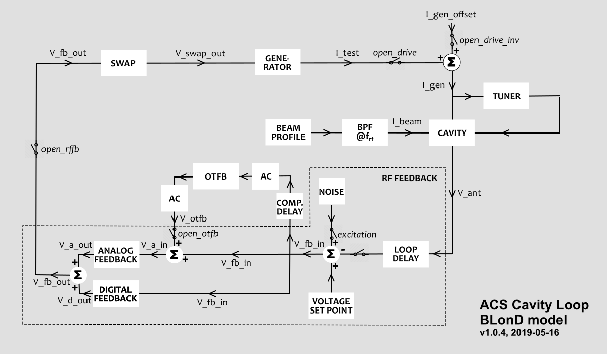

LHC Cavity Loop
===============
:Authors: **Birk Emil Karlsen-Bæck**, **Helga Timko**

The interaction of the LHC cavity loop with the beam is modelled on a turn-by-turn basis. All arrays inside the class
:py:class:`blond.llrf.cavity_feedback.LHCCavityLoop` are complex arrays with a memory of exactly 2 turns (previous and
present). The signals are digitised with a sampling time :math:`T_s` that adapts to the revolution period to have
exactly

.. code-block:: python

    N = int(self.rf.harmonic[0, 0]/10)

samples over one turn. The feedback is pre-tracked without beam.

STEP 1: Calculate RF beam current
---------------------------------

The RF beam current is calculated for the entire turn, based on the beam profile :math:`\lambda_k`, where the
sampling time is typically much smaller than T_s.

STEP 2: Cavity-generator-beam interaction
-----------------------------------------

Within one turn, the update of parameters happens sample by sample, for :math:`n = 0...N-1`. First, the antenna voltage
measured in the RF cavity :math:`V_{\mathsf{ant}}` is updated based on the time evolution derived in [JT2011]_

.. math::

    I_{\mathsf{gen}}(t) = \frac{V_{\mathsf{ant}}(t)}{2 R/Q} \left( \frac{1}{Q_L} - 2 i \frac{\Delta \omega}{\omega} \right)
    + \frac{d V_{\mathsf{ant}}(t)}{dt} \frac{1}{\omega R/Q} + \frac{1}{2} I_{\mathsf{beam,RF}}(t)

Here :math:`I_{\mathsf{gen}}` is the generator forward current, :math:`I_{\mathsf{beam,RF}}` is the RF beam current,
:math:`R/Q` is the cavity's ratio of shunt impedance and quality factor, :math:`Q_L` the loaded quality factor,
:math:`\omega` the rf frequency, and :math:`\Delta \omega \equiv \omega_c - \omega` the detuning of the cavity w.r.t.\
the central frequency :math:`\omega_c`. In the discrete implementation, the equation reads as follows:

.. math::

    V_{\mathsf{ant}}^{(n)} = \frac{R}{Q} \omega T_s \, I_{\mathsf{gen}}^{(n-1)} + \left( 1 - \frac{\omega T_s}{2 Q_L} +
    i \Delta \omega T_s \right) V_{\mathsf{ant}}^{(n-1)} - \frac{1}{2} \frac{R}{Q} \omega T_s \, I_{\mathsf{beam,RF}}^{(n-1)} \, ,

where the upper indices denote the sample number.

STEP 3: RF feedback response
----------------------------

The RF feedback acts on the difference between measured antenna voltage and required set point voltage
:math:`V_{\mathsf{set}}`:

.. math::

    V_{\mathsf{fb,in}}^{(n)} = V_{\mathsf{set}}^{(n)} - V_{\mathsf{ant}}^{(n - n_{\mathsf{loop}})} \, ,

where the overall loop delay :math:`\tau_{\mathsf{loop}}=650 \mathsf{ns}` is taken into account in the antenna signal
delayed by :math:`n_{\mathsf{loop}} \equiv int(\tau_{\mathsf{loop}})/T_s`.

Analog feedback
~~~~~~~~~~~~~~~

The analog feedback has a gain :math:`G_a` at high frequencies and in Laplace domain its transfer function is:

.. math::

    \frac{Y(s)}{X(s)} = H_a(s) = G_a \frac{\tau_a s}{1 + \tau_a s} ,

where :math:`X(s)` and :math:`Y(s)` are the input and output signals, respectively. In the LHC, the typical delay is
:math:`\tau_a = 170 \mathsf{\mu s}` (based on AC coupling at demodulator exit), and the optimum gain for a flat closed-
loop response is

.. math::

    G_a = \frac{1}{2\frac{R}{Q} \omega \tau_{\mathsf{loop}}} \, ,

which for a loop delay of :math:`\tau_{\mathsf{loop}} = 650 \mathsf{ns}` results in :math:`G_a = 6.79 \times 10^{-6}
\mathsf{\frac{A}{V}}`. Note that :math:`G_a` converts the voltage signal to a current signal.

In discrete time domain, the output signal :math:`y(t)` is calculated from the input signal :math:`x(t)` as follows:

.. math::

    y^{(n)} = \left[ 1 - \frac{T_s}{\tau_a} \right] \, y^{(n-1)} + G_a(x^{(n)} - x^{(n-1)})

Digital feedback
~~~~~~~~~~~~~~~~

The digital feedback, opposite to the analog feedback, has a high gain at low frequencies,

.. math::

    \frac{Y(s)}{X(s)} = H_d(s) = G_a G_d \frac{e^{i \Delta \varphi_{\mathsf{ad}}}}{1 + \tau_d s} ,

where the digital gain is typically :math:`G_d=10`, and the dephasing between the analog and digital feedbacks is to be
minimized, :math:`\Delta \varphi_{\mathsf{ad}} \approx 0`.

In discrete time domain, the signal reads as

.. math::

    y^{(n)} = \left[ 1 - \frac{T_s}{\tau_d} \right] \, y^{(n-1)} + G_a G_d e^{i \Delta \varphi_{\mathsf{ad}}}
    \frac{T_s}{\tau_d} \, x^{(n-1)}

One-turn feedback
~~~~~~~~~~~~~~~~~

There is the possibility to switch on the one-turn feedback to boost the gain of the analog feedback. On the branch of
the one-turn feedback (OTFB), there is a delay that is complementary to the total loop delay as seen by the OTFB
:math:`\tau_{\mathsf{otfb}}`,
:math:`T_0 - \tau_{\mathsf{otfb}}`, where :math:`T_0` is the revolution period in that turn.

The response of the one-turn feedback itself reads as follows:

.. math::

    \frac{Y(s)}{X(s)} = H_{\mathsf{OTFB}}(s) = G_o \frac{(1 - \alpha) e^{-T_0s}}{1 - \alpha e^{-T_0s}} \, ,

where :math:`G_o = 10` and :math:`\alpha=15/16` usually.

In time domain, the signal from the previous turn is used to construct the signal at the current turn,

.. math::

    y^{(n)} = \alpha y^{(n - N)} + G_o (1 - \alpha) x^{(n - N)} \, .

Both at the input and the output, an AC coupling ensures that unwanted frequencies are filtered out,

.. math::

    \frac{Y(s)}{X(s)} = H_{\mathsf{AC,OTFB}}(s) = \frac{\tau_o s}{1 + \tau_o s}

where the time constant is around :math:`\tau_o=110 \mathsf{\mu s}`.

In time domain, this reads as

.. math::

    y^{(n)} = \left[ 1 - \frac{T_s}{\tau_o} \right] \, y^{(n - 1)} + x^{(n)} - x^{(n - 1)} \, .

In addition, a 63-tap finite-impulse response (FIR) filter is used to limit the bandwidth of the overall response.

The numerical implementation thus consists of the following four steps, in the below-mentioned order:

1. AC coupling at input on the signal of the previous turn, combined with OTFB delay :math:`T_0 - \tau_{\mathsf{otfb}}` at input,

.. math::

       y^{(n - N)} = \left[ 1 - \frac{T_s}{\tau_o} \right] \, y^{(n - N - 1)} + x^{(n - N + n_{\mathsf{otfb}})} -
    x^{(n - N + n_{\mathsf{otfb}} - 1)} \,

where :math:`N = \mathsf{int}(T_0/T_s)` and :math:`n_{\mathsf{otfb}} = \mathsf{int}(\tau_{\mathsf{otfb}}/T_s + n_\mathsf{taps} - 1)/2)`,
with :math:`n_\mathsf{taps}` being the number of taps of the FIR filter,

2. OTFB response,

.. math::

    z^{(n)} =  \alpha z^{(n - N)} + G_o (1 - \alpha) y^{(n - N)}

3. FIR filter response; N.B. this introduces an extra delay of :math:`(n_\mathsf{taps} - 1)/2` which is already compensated in step 1.

.. math::

    v^{(n)} = b_0 z^{(n)} + b_1 z^{(n-1)} + ... + b_{n_\mathsf{taps}} z^{(n - n_\mathsf{taps})}

4. AC coupling at output.

.. math::

    w^{(n)} = \left[ 1 - \frac{T_s}{\tau_o} \right] \, w^{(n - 1)} + v^{(n)} -
    v^{(n - 1)}

STEP 4: Switch and protect response
-----------------------------------

STEP 5: Generator response
--------------------------

STEP 6: Tuner control
---------------------
The tuner control acts using the signal :math:`I_g \times V_a`, which is equivalent to
:math:`\Im \left \{ I_g \overline{V}_a \right \}` in the complex plane. Here the bar denotes the complex conjugate.
This signal is down sampled using a CIC filter with the following transfer function

.. math::

    \frac{Y(s)}{X(s)} = H_\textrm{CIC}(s) = \frac{1}{64} \left ( \frac{1 - e^{-8 T_s s}}{1 - e^{-T_s s}} \right )^2

which is

.. math::

    y^{(n)} = \frac{1}{64} \left ( x^{(n)} - 2 x^{(n - 8)} + x^{(n - 16)} \right ) + 2 y^{(n - 1)} - y^{(n - 2)}

in discrete time-domain. The maximum and minimum value of the output, :math:`\Im \left \[ I_g \overline{V}_a \right \]`,
for a turn :math:`k` is then used to generate a correction to the central frequency of the cavity for turn
:math:`k + 1` in the following way

.. math::

    \left( \frac{\Delta f}{f_c} \right)_{k + 1} = \left( \frac{\Delta f}{f_c} \right)_{k} - \frac{\mu}{2}
    \frac{\Im \left[ I_g \overline{V}_a \right]_\textrm{min} + \Im \left[ I_g \overline{V}_a \right]_\textrm{max}}
    {V_\textrm{set}^2}

References
----------

.. [JT2011] Joachim Tückmantel: *'Cavity-beam-transmitter interaction formula collection with derivation'*,
    CERN-ATS-Note-2011-002 TECH, CERN, Geneva, Switzerland, 2011.
